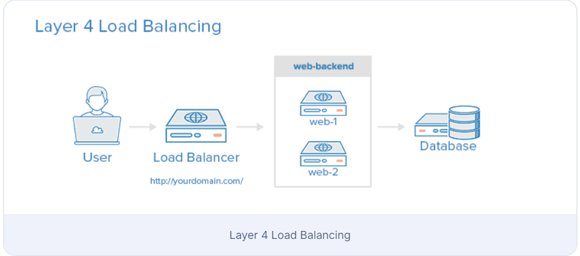
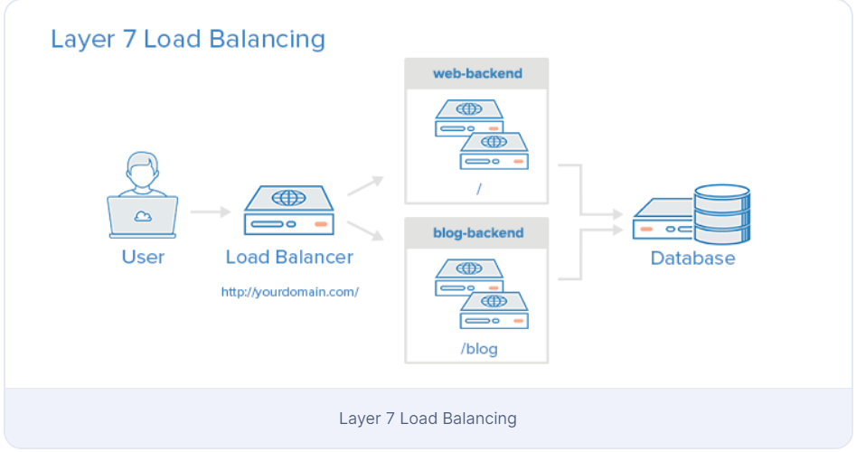
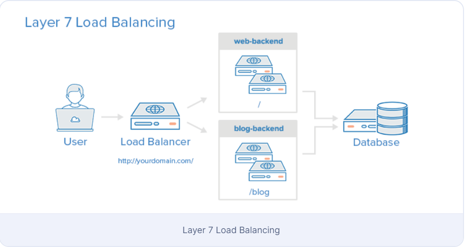

# Tổng quan về HAProxy và Load Balancing

HAProxy, viết tắt của High Availability Proxy, là một giải pháp phần mềm mã nguồn mở phổ biến về TCP/HTTP Load Balancer và proxying có thể chạy trên Linux, macOS và FreeBSD. Sử dụng phổ biến nhất của nó là cải thiện hiệu suất và độ tin cậy của một môi trường máy chủ bằng cách phân phối công việc trên nhiều máy chủ (ví dụ: web, ứng dụng, cơ sở dữ liệu). Nó được sử dụng trong nhiều môi trường có uy tín, bao gồm: GitHub, Imgur, Instagram và Twitter.

## Thuật ngữ về HAProxy

### Access control list (ACL)

Liên quan đến phân phối tải, ACLs được sử dụng để kiểm tra một điều kiện và thực hiện một hành động (ví dụ: chọn một máy chủ hoặc chặn một yêu cầu) dựa trên kết quả kiểm tra. Việc sử dụng ACLs cho phép chuyển tiếp linh hoạt lưu lượng mạng dựa trên một loạt các yếu tố như khớp mẫu và số lượng kết nối tới backend

### Backend
Backend là một tập hợp các máy chủ nhận yêu cầu được chuyển tiếp. Backend được xác định trong phần backend của cấu hình HAProxy. Ở dạng cơ bản nhất, một backend có thể được xác định bằng:

	- Thuật toán cân bằng tải sẽ sử dụng

	- Một danh sách máy chủ và cổng

Một backend có thể chứa một hoặc nhiều máy chủ. Nói chung, thêm nhiều máy chủ vào backend của bạn sẽ tăng khả năng chứa tải bằng cách phân phối tải qua nhiều máy chủ. Độ tin cậy tăng lên cũng được đạt được thông qua cách này, trong trường hợp một số máy chủ backend của bạn trở nên không khả dụng.

Dưới đây là một ví dụ về cấu hình hai backend, web-backend và blog-backend với hai máy chủ web trong mỗi backend, lắng nghe trên cổng 80:

```sh
backend web-backend
balance roundrobin
server web1 web1.yourdomain.com:80 check
server web2 web2.yourdomain.com:80 check

backend blog-backend
balance roundrobin
mode http
server blog1 blog1.yourdomain.com:80 check
server blog1 blog1.yourdomain.com:80 check
```

- Dòng **balance roundrobin** chỉ định thuật toán cân bằng tải

- mode http chỉ định rằng việc proxy layer 7 sẽ được sử dụng

### Frontend
Một frontend xác định cách yêu cầu sẽ được chuyển tiếp tới các backend. Frontends được xác định trong phần frontend của cấu hình HAProxy. Định nghĩa của chúng bao gồm các thành phần sau:

- Một tập hợp các địa chỉ IP và một cổng (ví dụ: 10.1.1.7:80, *:443, vv.)
- ACLs
- Quy tắc use_backend, xác định các backend sẽ được sử dụng tùy thuộc vào các điều kiện ACL khớp, và/hoặc một quy tắc default_backend xử lý mọi trường hợp khác

Một frontend có thể được cấu hình để xử lý các loại lưu lượng mạng khác nhau

## Types of Load Balancing

### Không cân bằng tải
Một môi trường ứng dụng web đơn giản không có cân bằng tải có thể trông giống như sau:



Trong ví dụ này, người dùng kết nối trực tiếp với máy chủ web của bạn, tại yourdomain.com và không có cân bằng tải. Nếu máy chủ web duy nhất của bạn gặp sự cố, người dùng sẽ không thể truy cập được máy chủ web của bạn nữa. Ngoài ra, nếu nhiều người dùng cố gắng truy cập máy chủ của bạn cùng một lúc và nó không thể xử lý được tải, họ có thể gặp phải trải nghiệm chậm chạp hoặc họ có thể không thể kết nối được hoàn toàn.


### Phân phối tải ở Layer 4
Cách đơn giản nhất để phân phối tải lưu lượng mạng đến nhiều máy chủ là sử dụng phân phối tải ở Layer 4 (lớp vận chuyển). Phân phối tải theo cách này sẽ chuyển tiếp lưu lượng người dùng dựa trên dải địa chỉ IP và cổng (tức là nếu một yêu cầu được gửi tới http://yourdomain.com/anything, lưu lượng sẽ được chuyển tiếp tới backend xử lý tất cả các yêu cầu cho yourdomain.com trên cổng 80). 
Dưới đây là một sơ đồ của một ví dụ đơn giản về phân phối tải ở Layer 4:



Người dùng truy cập vào cân bằng tải, cân bằng tải chuyển tiếp yêu cầu của người dùng tới nhóm máy chủ backend web-backend. Bất kỳ máy chủ backend nào được chọn sẽ phản hồi trực tiếp cho yêu cầu của người dùng. Nói chung, tất cả các máy chủ trong web-backend nên đang phục vụ nội dung giống nhau – nếu không, người dùng có thể nhận được nội dung không nhất quán. Lưu ý rằng cả hai máy chủ web đều kết nối tới cùng một máy chủ cơ sở dữ liệu.


### Phân phối tải ở Layer 7
Một cách phức tạp hơn để phân phối tải lưu lượng mạng là sử dụng phân phối tải ở Layer 7 (lớp ứng dụng). Sử dụng Layer 7 cho phép cân bằng tải chuyển tiếp yêu cầu tới các máy chủ backend khác nhau dựa trên nội dung của yêu cầu của người dùng. Cách phân phối tải này cho phép bạn chạy nhiều máy chủ ứng dụng web dưới cùng một miền và cổng.



Trong ví dụ này, nếu một người dùng yêu cầu yourdomain.com/blog, họ sẽ được chuyển tiếp tới backend blog, đó là một tập hợp các máy chủ chạy ứng dụng blog. Các yêu cầu khác được chuyển tiếp tới web-backend, có thể đang chạy một ứng dụng khác. Cả hai backend đều sử dụng cùng một máy chủ cơ sở dữ liệu, trong ví dụ này.

Một phần của cấu hình frontend ví dụ sẽ trông như sau:

```sh
frontend http
  bind *:80
  mode http

  acl url_blog path_beg /blog
  use_backend blog-backend if url_blog
 
  default_backend web-backend
```

Cấu hình này xác định một frontend có tên là http, xử lý tất cả lưu lượng đến trên cổng 80.

acl url_blog path_beg /blog khớp với một yêu cầu nếu đường dẫn của yêu cầu của người dùng bắt đầu với /blog.

use_backend blog-backend if url_blog sử dụng ACL để chuyển tiếp lưu lượng tới blog-backend.

default_backend web-backend chỉ định rằng tất cả các lưu lượng khác sẽ được chuyển tiếp tới web-backend.


## Thuật toán cân bằng tải

Thuật toán cân bằng tải được sử dụng xác định máy chủ nào, trong một backend, sẽ được chọn khi cân bằng tải. HAProxy cung cấp một số lựa chọn cho thuật toán. Ngoài thuật toán cân bằng tải, các máy chủ có thể được gán một tham số trọng số để điều chỉnh tần suất máy chủ được chọn, so với các máy chủ khác.

Một số thuật toán phổ biến được sử dụng như sau:

- roundrobin: Round Robin chọn máy chủ theo thứ tự. Đây là thuật toán mặc định.
- leastconn: Chọn máy chủ có số kết nối ít nhất. Đây được khuyến nghị cho các phiên dài hơn. Các máy chủ trong cùng một backend cũng được xoay vòng theo cách round-robin.
- source: Lựa chọn máy chủ sử dụng dựa trên một hash của địa chỉ IP nguồn mà người dùng đang tạo yêu cầu. Phương pháp này đảm bảo rằng cùng một người dùng sẽ kết nối tới cùng một máy chủ.

### Sticky Sessions
Một số ứng dụng yêu cầu người dùng tiếp tục kết nối tới cùng một máy chủ backend. Điều này có thể được thực hiện thông qua phiên dính (sticky sessions), sử dụng tham số appsession trong backend yêu cầu điều đó.

### Health Check
HAProxy sử dụng Health Check để xác định xem một máy chủ backend có sẵn để xử lý các yêu cầu hay không. Điều này tránh việc phải loại bỏ thủ công một máy chủ khỏi backend nếu nó trở nên không khả dụng. Health Check mặc định là thử thiết lập một kết nối TCP tới máy chủ.

Nếu một máy chủ không vượt qua Health Check và do đó không thể phục vụ các yêu cầu, nó sẽ tự động bị vô hiệu hóa trong backend, và lưu lượng sẽ không được chuyển tiếp tới nó cho đến khi nó trở lại lành mạnh. Nếu tất cả các máy chủ trong một backend thất bại, dịch vụ sẽ trở thành không khả dụng cho đến khi ít nhất một trong số các máy chủ backend đó trở lại lành mạnh.

Đối với một số loại backend như máy chủ cơ sở dữ liệu, Health Check mặc định không nhất thiết là để xác định liệu một máy chủ có còn lành mạnh hay không.

Máy chủ web Nginx cũng có thể được sử dụng như một máy chủ proxy độc lập hoặc cân bằng tải, và thường được sử dụng kết hợp với HAProxy cho khả năng caching và nén của nó.

### High Availability
Cả hai cài đặt cân bằng tải ở Layer 4 và 7 mô tả trong hướng dẫn này đều sử dụng một cân bằng tải để chuyển hướng lưu lượng tới một trong nhiều máy chủ backend. Tuy nhiên, cân bằng tải của bạn là một điểm hỏng lớn trong các cài đặt này; nếu nó bị down hoặc bị quá tải với yêu cầu, nó có thể gây ra độ trễ cao hoặc thời gian ngừng hoạt động cho dịch vụ của bạn.

Một cài đặt có khả năng sẵn sàng cao (HA) được định nghĩa rộng rãi là hạ tầng không có một điểm hỏng duy nhất. Nó ngăn chặn một sự cố của một máy chủ duy nhất trở thành một sự kiện ngừng hoạt động bằng cách thêm sự dư thừa cho mỗi tầng của kiến trúc của bạn. Một cân bằng tải tạo điều kiện dư thừa cho tầng backend (máy chủ web/ứng dụng), nhưng để có một cài đặt khả năng sẵn sàng cao thực sự, bạn cần có cân bằng tải dư thừa cũng. 